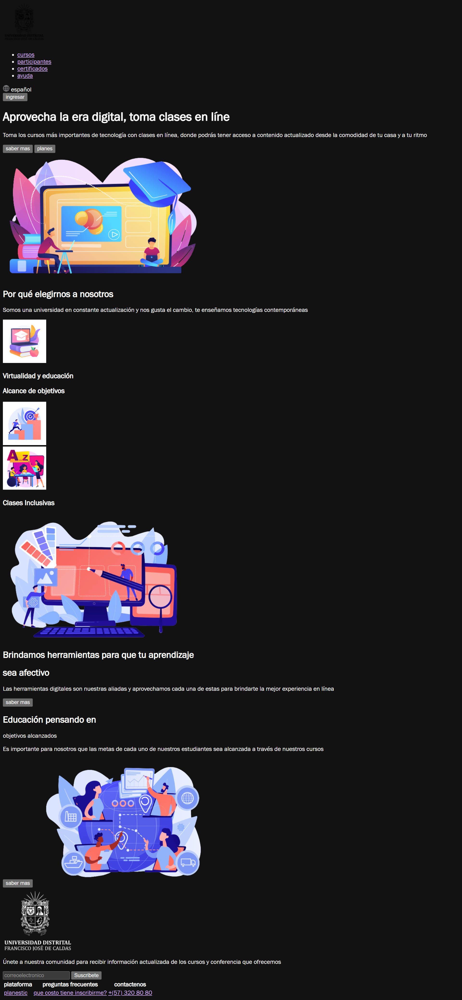
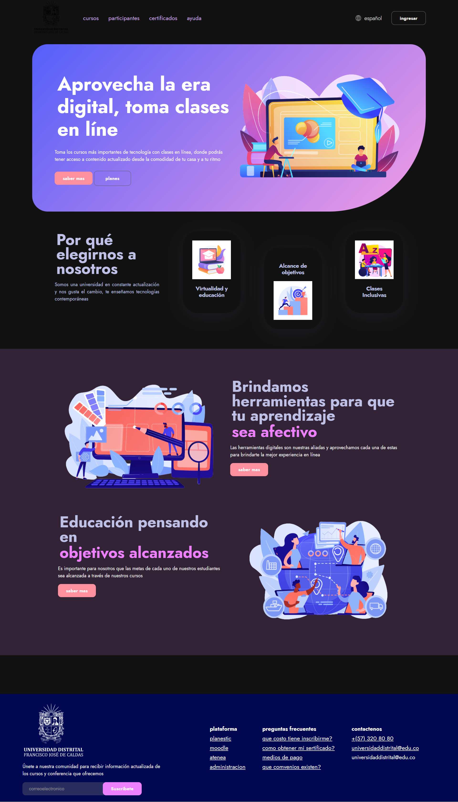
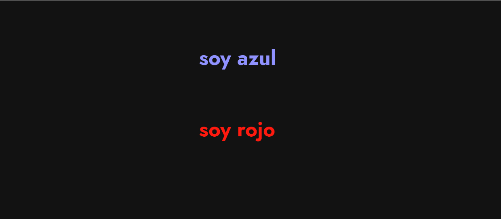
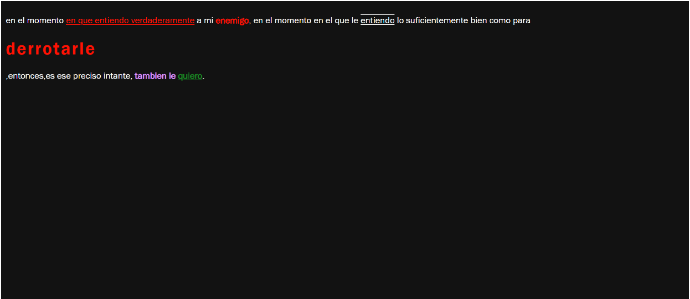
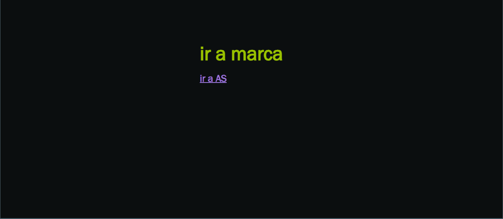
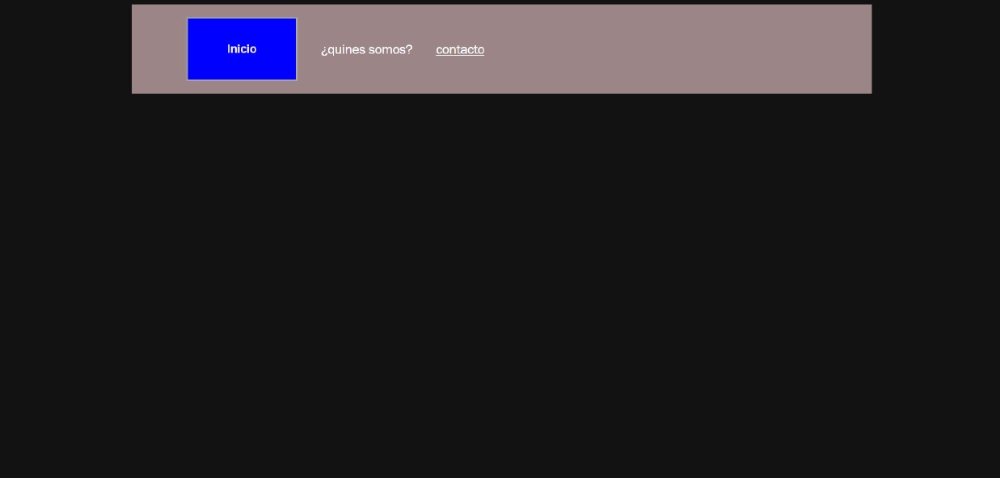
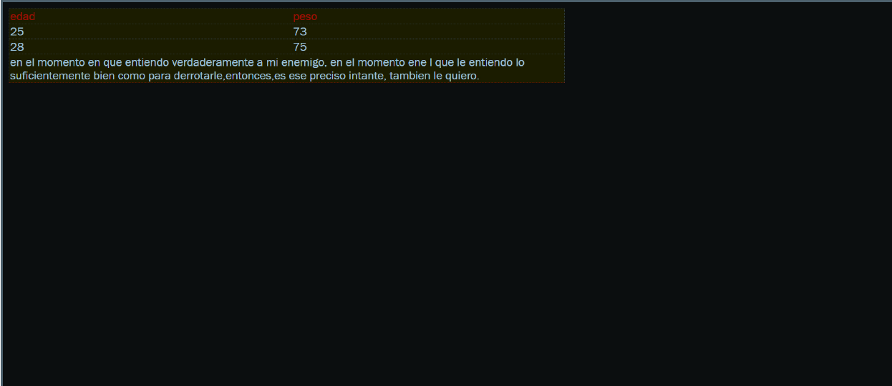

<h1>taller 9 stiven cristancho</h1>

<h2>informacion </h2>

curso : full stack basico - grupo 1 

profesor: cristian patiño 

<h2>punto 1: link figma</h2>
<a href="https://www.figma.com/file/hrY04JjKIthDB044MaswKP/stiven-cristancho---figmaecercise?type=design&node-id=0%3A1&t=jMOz21IpO3AGnzOi-1">link de figma</a> 
<h2>link pagina</h2>
<a href="https://2stiven0.github.io/taller-9-fullstack/">link de pagina wed</a> 
<h2>Punto: 2 html</h2>

<h2>Punto: 3 css</h2>

<h2>Punto: 4 css</h2>

<h2>Punto: 5 css</h2>

<h2>Punto: 6 css</h2>

<h2>Punto: 7-8 css</h2>

<h2>Punto: 9 css</h2>

